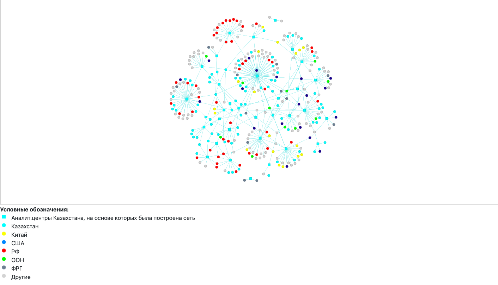

# Визуализация связей казахстанских аналитических центров

## Описание
В рамках стажировки в одной аналитической компании было дано задание создать визуализацию сети аналитических центров Казахстана. Визуализация сети была создана на основе данных о международных и внутренних связях казахстанских аналитических центров, информация о которых была собрана посредством парсинга страниц новостей и соцсетей каждого центра. Так, если о встречах или совместных конференциях было более двух упоминаний с 2018 года в новостях одного из анализируемых центров, то между вершинами создавалась парная связь. В результате работы был получен html-файл с визуализацией сети казахстанских аналитических центров и иностранных субъектов, имеющих устойчивые связи с ними.

В созданной визуализации предусмотрены поисковая строка и легенда

## Инструменты и навыки:
- Понимание html кода
- pyvis
- pandas

## Результат: 
(Поисковая строка не вошла в картинку)

